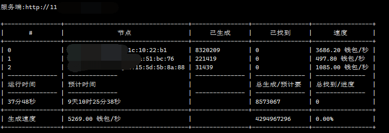
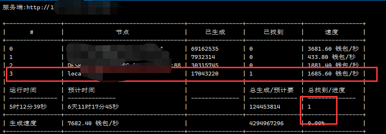

## 分布式生成钱包

## 快速开始
### 下载二进制文件(或者自行构建), 现在基本都是`amd`架构, 如果不能运行,自行把链接中的`amd`换成`arm`(比如安卓中)

| 系统        | 命令                                                                                                                                                                                                                                                                                                 |
|-----------|----------------------------------------------------------------------------------------------------------------------------------------------------------------------------------------------------------------------------------------------------------------------------------------------------|
| **Linux**    | `wget https://github.com/seth-shi/ethereum-wallet-generator-nodes/releases/download/v9.9.9/ethereum-wallet-generator-nodes-v9.9.9-linux-amd64.tar.gz`                                                                                                                                              |
| **Windows** | 点击下载[https://github.com/seth-shi/ethereum-wallet-generator-nodes/releases/download/v9.9.9/ethereum-wallet-generator-nodes-v9.9.9-windows-amd64.zip](https://github.com/seth-shi/ethereum-wallet-generator-nodes/releases/download/v9.9.9/ethereum-wallet-generator-nodes-v9.9.9-windows-amd64.zip) |
| **macOS** | `wget https://github.com/seth-shi/ethereum-wallet-generator-nodes/releases/download/v9.9.9/ethereum-wallet-generator-nodes-v9.9.9-darwin-amd64.tar.gz`                                                                                                                                             |

### 解压文件

| 系统        | 命令                                                                  |
|-----------|---------------------------------------------------------------------|
| **Linux**    | `tar xvf ethereum-wallet-generator-nodes-v9.9.9-linux-amd64.tar.gz` |
| **Windows** | 双击解压                                                                |
| **macOS** | 双击解压                                                                |

### `master`运行 (必须有公网服务器), 会输出公网`$url`

| 系统        | 命令                                                                         |
|-----------|----------------------------------------------------------------------------|
| **Linux**    | `./ethereum-wallet-generator-nodes master --prefix=0x0000 --suffix=9999`   |
| **Windows** | `ethereum-wallet-generator-nodes.exe master --prefix=0x0000 --suffix=9999` |
| **macOS** | `./ethereum-wallet-generator-nodes master --prefix=0x0000 --suffix=9999`   |

### 节点运行, 手机, 电脑, 台式机 (会统一从服务端拉取配置, 然后上报进度)

| 系统        | 命令                                                                         |
|-----------|----------------------------------------------------------------------------|
| **Linux**    | `./ethereum-wallet-generator-nodes  node --server={$url}`   |
| **Windows** | `ethereum-wallet-generator-nodes.exe  node --server={$url}` |
| **macOS** | `./ethereum-wallet-generator-nodes master  node --server={$url}`   |

## 已生成成功
* `0x0000f31fE398080ef162841Cae9111735C919999`

